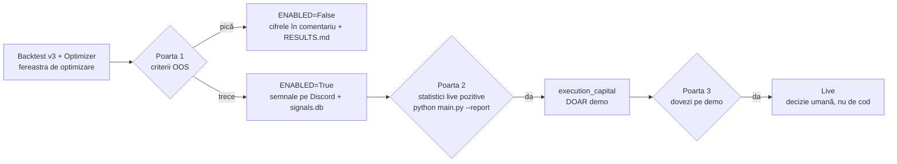
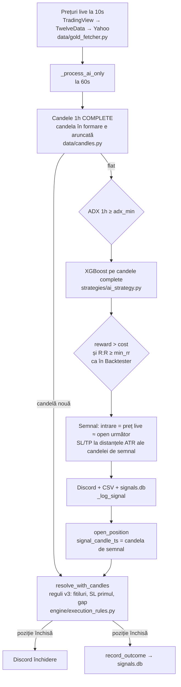

# Arhitectura CFD_Game

> Referință permanentă pentru dezvoltare. Filosofia proiectului: **colectăm
> dovezi, nu bani.** Orice decizie de activare/execuție trece prin porți de
> dovezi out-of-sample, după costuri, cu execuție pesimistă.

## 1. Cele trei componente și porțile

| Componentă | Rol | Stare |
|---|---|---|
| `gold_monitor/` | Monitor de semnale (XGBoost 1h + 2 strategii clasice 5m → vot → Discord + SQLite). **Nu execută tranzacții.** | Activă, dar toate instrumentele `ENABLED=False` |
| `execution_capital/` | Bot de execuție Capital.com | **Carantină** până la Poarta 2 |
| `trading_game/` | Simulare competitivă pentru descoperirea ponderilor de indicatori | Studiu încheiat (lecție în `trading_game/results/REPORT.md`) |
| `sentinel/` | Santinelă pe cont **DEMO**: Claude Fable 5.1 aprobă/respinge semnalele deterministe și gestionează pozițiile, în limite hard din cod (v3.2) | Activă pe demo (Gold + BTC, `DEMO_ENABLED`) |
| `common/indicators.py` | **Unica** implementare de indicatori (RSI, EMA, MACD, BB, ATR, ADX), reexportată de `gold_monitor/data/indicators.py` | Partajată |

### Traseul porților

**Criteriile Porții 1** (toate, pe OOS, net de costuri — definite în
`gold_monitor/tools/run_evaluation.py:49`):
≥30 trades · PF ≥ 1.15 · expectanță medie/trade > 0 · maxDD < 15% ·
trade-Sharpe > 0.5.

**De ce e totul dezactivat acum**: evaluarea Faza 4 (2026-08-25) — Gold
+30.5% pe fereastra de optimizare dar **−16.2% OOS** (overfit clasic); BTC
negativ chiar și in-sample. Cifrele complete: `RESULTS.md`; verdictul e și în
comentariile din `gold_monitor/config/settings.py:89` (Gold) și `:141` (BTC).
Regulă permanentă: **fereastra OOS se rulează o singură dată per
configurație** — cea din RESULTS.md e consumată; un test nou cere date noi.

---

## 2. Fluxul monitorului live (`--monitor`)

Intrare: `gold_monitor/main.py:123` (`cmd_monitor`) — dacă niciun instrument
nu e `ENABLED`, explică poarta și iese (`main.py:127-133`). Altfel pornește
`MonitorEngine.run()` (`engine/monitor_engine.py`).

**Din v3.1 modul implicit este `SIGNAL_MODE="ai_only"`**
(`config/settings.py`, `MonitorConfig`): calea live reproduce exact
modelul validat de backtester. Regula de aur: *ce validezi este ce rulezi*.

Detalii importante:

- **Numai candele complete** (`data/candles.py`, `drop_incomplete_candle`):
  yfinance întoarce candela în formare ca ultimul rând; modelul e evaluat
  doar pe close-uri de candele încheiate, ca în backtest.
- **O singură evaluare per candelă 1h nouă** (`_ai_only_step`,
  `monitor_engine.py`): întâi outcome-ul poziției deschise (regulile v3
  din `engine/execution_rules.py`, aceleași folosite de backtester), apoi,
  doar dacă e flat, predicția + gate-ul ADX pe 1h + filtrul cost/R:R.
- **Intrarea** = prețul live din momentul semnalului (echivalentul
  „open-ului candelei următoare"); SL/TP păstrează distanțele ATR ale
  candelei de semnal, ancorate la intrarea reală — exact ca
  `_simulate_trades`.
- **Absente intenționat** în `ai_only`: filtrul de sesiune, închiderea EOD,
  trailing SL, votul între strategii — nu există în modelul validat.
  Modul `vote` (legacy) le păstrează pentru experimente, dar nu e validat
  de backtester și nu trebuie folosit pentru colectarea de dovezi.
- **Restart-safe**: la pornire, semnalele fără outcome sunt rejucate din
  candele (`PositionTracker.restore_from_store`,
  `engine/position_tracker.py`): cele vechi până la semnalul următor
  (altfel `SIGNAL_REVERSED` la intrarea acestuia), cel mai nou redevine
  poziția deschisă. Nicio gaură în date după un crash.
- **Reantrenare automată în fundal la 6h** (`_retrain_background`);
  versiunea modelului e salvată per semnal tocmai de aceea.
- Execuția e **manuală pe XTB** — monitorul doar notifică.

### Persistența semnalelor (`data/signal_store.py`)

SQLite append-only (`signals.db`), schema la `signal_store.py:25-50`:

- **la emitere**: timestamp UTC, instrument, direcție, confidence,
  probabilități BUY/SELL/HOLD, ADX + regim, entry/SL/TP, strategie și
  **versiunea modelului** — `sha256(.pkl)[:12]@data-antrenării`
  (`signal_store.py:60`). De ce: fiecare semnal e trasabil la modelul exact
  care l-a produs; fără asta, după o reantrenare (care are loc automat la
  6h!) nu ai mai ști ce model a generat ce statistici.
- **la închidere** (o singură dată — `WHERE outcome IS NULL`,
  `signal_store.py:149`): outcome-ul ipotetic (TP_HIT / SL_HIT /
  TRAILING_SL_HIT / EOD_CLOSE / SIGNAL_REVERSED…), preț de ieșire, P&L brut
  și net de costuri. Completat de `PositionTracker.close_position`
  (`position_tracker.py:159-170`).
- `python main.py --report` (`main.py:177`) agregă per instrument (win
  rate, expectanță netă, retur ipotetic compus, maxDD —
  `signal_store.py:189`) și exportă CSV de audit în
  `output/signals_export.csv`.

Acesta e mecanismul Porții 2: dovezi live, nu doar backtest.

---

## 3. Modelul de execuție v3 (`gold_monitor/ai/backtester.py`)

Sursa unică de adevăr pentru simularea tranzacțiilor — folosită identic de
backtester (`run`, `backtester.py:457`), walk-forward (`run_walk_forward`,
`backtester.py:537`) și optimizer (prin `predict_fn` precomputat). Cele 6
reguli (docstring `backtester.py:4-16`, implementare în `_simulate_trades`,
`backtester.py:200`):

1. **Semnal pe CLOSE-ul candelei N → intrare pe OPEN-ul candelei N+1**
   (starea `pending`, `backtester.py:257-271`). Close-ul candelei curente nu
   e cunoscut în timp real la momentul deciziei.
2. **SL/TP verificate pe HIGH/LOW** — fitilurile contează, nu doar
   close-ul.
3. **SL+TP atinse în aceeași candelă → SL primul** — presupunerea
   conservatoare.
4. **Gap prin SL → execuție la OPEN** (preț mai prost, motiv `GAP_SL`);
   **TP exact la nivelul TP**, niciodată mai bine.
   Regulile 2–4 sunt implementate o singură dată în
   `engine/execution_rules.py` (`v3_exit`) și folosite identic de
   backtester și de tracker-ul live (v3.1).
5. **Închiderea forțată de final de perioadă actualizează equity-ul**
   (`backtester.py:316-328`) — bug-ul istoric înregistra trade-ul fără
   update de equity.
6. **Walk-forward folosește același motor**: `ExecutionState`
   (`backtester.py:54`) — equity, poziția deschisă și semnalul în așteptare
   — e transportat între ferestrele de reantrenare, nu resetat.

**De ce contează**: execuția legacy (păstrată doar pentru comparație în
`_simulate_trades_legacy`, `backtester.py:342`, cu bug-urile intacte) umfla
rezultatele cu ~20pp — pe aur, OOS **+2.26% legacy vs −16.17% v3**
(RESULTS.md, tabelul legacy vs v3). „Edge-ul" era în bug-uri: SL-uri lovite
de fitiluri care nu se declanșau, intrări pe prețuri necunoscute în timp
real, gap-uri umplute exact la SL, alegerea optimistă la SL+TP simultan.
Orice viitoare simulare trece prin acest motor — nu scrie altul.

Costurile sunt modelate în `CostConfig.round_trip_cost_pct`
(`config/settings.py:243`): model pips (gold: 3 pips × $0.10, dublate pentru
round-trip) sau model procentual `SPREAD_PCT` (BTC: 0.30% round-trip,
prioritar), plus slippage 0.5× spread.

---

## 4. Protocolul anti-overfitting (Faza 4)

Implementat în `gold_monitor/tools/run_evaluation.py` (protocol în
docstring, `:1-27`); rulare: `python tools/run_evaluation.py all`.

1. **Date**: 2 ani de candele 1h, descărcate o dată și cache-uite în
   `data_cache/` — optimizer-ul și backtester-ul văd exact aceleași date.
2. **Split 50/25/25** (`ai/optimizer.py:95-96`, `ai/backtester.py:484-485`):
   - primii 50% → antrenare model;
   - mijlocul 25% → **fereastra de optimizare**: grid search SL/TP/
     confidence/ADX/R:R + pragul de etichetare (`ai/optimizer.py:53-58`),
     totul prin motorul v3;
   - ultimii 25% → **OOS, fereastra de decizie, rulată o singură dată per
     configurație**. Optimizer-ul nu o atinge niciodată.
3. **Regula de selecție pre-declarată** (`ai/optimizer.py:57-60`,
   `select_best` la `:193`): cel mai bun scor `sharpe × PF` dintre combinațiile
   cu ≥30 trades pe fereastra de optimizare (fallback ≥15, apoi best
   overall). Declarată **înainte** de orice rulare OOS, niciodată ajustată
   după.
4. **Verdictul**: criteriile din §1 aplicate pe OOS → `ENABLED` True/False,
   cu JSON-ul complet salvat în `docs/evaluations/`.

De ce e strict: dacă re-rulezi OOS-ul după ce ai văzut rezultatul și ai
schimbat ceva, OOS-ul devine a doua fereastră de optimizare și cifra lui nu
mai înseamnă nimic. De aceea fereastra din RESULTS.md e „consumată".

---

## 4b. Nivelul demo: `DEMO_ENABLED` și santinela (`sentinel/`)

Decizie a proprietarului (2026-09-02), abatere explicită de la „zero LLM în
bucla de decizie”, limitată la contul **demo**:

- `InstrumentConfig.DEMO_ENABLED` (`gold_monitor/config/settings.py`) e un
  flag separat de `ENABLED` (care rămâne poarta pentru bani reali, toate
  `False`). Gold și BTC au `DEMO_ENABLED=True`: monitorul le rulează în
  modul `ai_only` și fiecare semnal poartă `tier="demo"` în `signals.db`.
- `sentinel/` citește `signals.db` (cursor `fetch_since`), cere lui Claude
  Fable 5.1 o cercetare de piață (web search, cache 1h) și o decizie
  **APPROVE/VETO + size_fraction** în JSON strict, apoi aplică regulile hard
  din `sentinel/rules.py` (1% risc, 3% pierdere zilnică, 5 trade-uri/zi, 2
  poziții, o poziție per instrument, R:R ≥ 1, semnal ≤ 15 min). Execută pe
  Capital.com **demo** prin clientul din `execution_capital/broker/`
  (`sentinel/broker.py` refuză `CAPITAL_MODE=live`). La 15 min revizuiește
  pozițiile: **HOLD / CLOSE / TIGHTEN_SL** — stop-ul se mută doar în
  favoarea poziției. Orice eșec al modelului = *fail closed*.
- Fiecare decizie e logată în `sentinel/data/decisions.db` (răspunsul
  modelului, motivarea, riscurile, regula care a blocat, tokens, deal_id,
  outcome/P&L). Semnalele respinse au totuși outcome ipotetic în
  `signals.db`, deci valoarea veto-ului e măsurabilă; `--no-llm` rulează
  calea deterministă ca grup de control.
- Procesele nu se importă reciproc (`gold_monitor` și `execution_capital`
  au pachete cu aceleași nume): santinela e un proces separat care
  comunică doar prin SQLite. Detalii: `sentinel/README.md`.

---

## 5. `execution_capital/` — reparat, dar dormant

Bot de execuție Capital.com, **în carantină** (nu se pornește, nu se
dezvoltă spre live; `execution_capital/README.md`). Bug-urile de risc au
fost reparate „dormant":

- **Sizing valutar**: `RiskManager._quote_to_account_rate`
  (`execution_capital/risk/risk_manager.py:63-75`) — un instrument cotat în
  altă monedă decât contul e **refuzat** dacă lipsește rata de conversie
  (înainte: sizing greșit pe perechi gen USDJPY).
- **`MAX_TRADES_PER_DAY` aplicat efectiv** (`risk_manager.py:93`) —
  înainte contorul era incrementat dar ignorat.
- **Anti-corelare FX**: maximum o poziție FX simultan.
- **Risc redus**: 1% per trade (era 3%), limită zilnică 3% (era 10%).

`CAPITAL_MODE=live` e blocat de proces (Poarta 3), nu de cod — nu se
atinge. Testele lui rulează izolat în subproces
(`tests/test_execution_capital.py`; `pytest.ini` exclude directorul de la
colectarea directă).

---

## 6. `trading_game/` pe scurt

Simulare competitivă (spec: `docs/trading_game_prompt.md`): 7 jucători cu
metode proprii de ponderare a indicatorilor (equal_weight, correlation_ic,
random_forest, xgboost, genetic, momentum, mean_reversion —
`trading_game/players/`), pe segmente **60/20/20**
(2015-19 training / 2020-21 validare / 2022-23 test,
`trading_game/config.py`).

- **Crupier** (`trading_game/crupier.py`): toate tranzacțiile trec pe aici —
  validare, costuri realiste, lichiditate max 1% ADV, integritate temporală
  (anti look-ahead), eliminări, validarea recalibrărilor (trimestrial, ≤30%
  shift).
- **Competiția** (`trading_game/game.py:147-176`): 24 de luni cu eliminări
  lunare (ultimul la ≥20% de penultimul; drawdown >50% → eliminare
  imediată).
- **Testul**: ponderi înghețate, o singură trecere; validare statistică
  (`trading_game/validation.py`): bootstrap CI 95% pe Sharpe, permutation
  test vs S&P 500, stress pe ferestre de criză.

**Lecția** (`trading_game/results/REPORT.md`): câștigătorul validării
(momentum, +27% / Sharpe 0.93) a făcut **−0.44% pe test**, CI [−1.47, 1.40],
p=0.854 vs piață — nesemnificativ statistic. Aceeași lecție ca în
RESULTS.md: clasamentul in-sample nu garantează nimic out-of-sample;
„ponderile optime" au valoare doar ca prior de pornire.

---

## 7. Unde intervii ca să extinzi X

### Instrument nou

1. Adaugă un `InstrumentConfig` în lista `INSTRUMENTS`
   (`gold_monitor/config/settings.py:78`), cu `ENABLED=False`: simboluri
   (yfinance + TradingView + TwelveData), `MODEL_PATH` nou, modelul de cost
   corect (pips pentru gold/FX, `SPREAD_PCT` pentru crypto),
   `SESSION_24_7` dacă e cazul, `THRESHOLD_GRID` dacă volatilitatea diferă
   de a aurului.
2. Antrenează: `python main.py --train <nume>` (filtrul explicit atinge și
   instrumente dezactivate — `main.py:36`).
3. Rulează protocolul complet: `python tools/run_evaluation.py <nume>`
   (adaugă instrumentul în maparea CLI a scriptului dacă e nevoie).
4. `ENABLED=True` **doar** dacă OOS-ul trece criteriile; altfel lași
   `False` cu cifrele în comentariu (modelul: `settings.py:89-96`).

### Strategie nouă (clasică)

1. Subclasează `BaseStrategy` (`gold_monitor/strategies/base_strategy.py:9`)
   și implementează `analyze(epic, df) -> Optional[Signal]` (vezi
   `scalping_strategy.py:23` ca model; `Signal` e definit în
   `engine/signal.py:6`).
2. Instanțiaz-o în `InstrumentMonitor.__init__`
   (`monitor_engine.py:38-44`), ruleaz-o în `_run_analysis`
   (`monitor_engine.py:321-326`) și adaug-o la vot în `_vote_signals`
   (`monitor_engine.py:234-238`) cu o pondere nouă în `StrategyConfig`
   (`settings.py:214-218`; ponderile trebuie să rămână coerente cu
   `VOTE_THRESHOLD`).
3. Dacă vrei s-o validezi istoric, simulează prin motorul v3 (un
   `predict_fn` pentru `_simulate_trades`) — nu scrie alt simulator.

### Feature nou în model

1. Adaugă numele în `FeatureEngineer.FEATURE_NAMES`
   (`gold_monitor/ai/feature_engineer.py:19`) și calculul în
   `create_features` (`:33`). Atenție la look-ahead: folosește doar valori
   disponibile la close-ul candelei curente.
2. Reantrenează (`--train`) — modelul vechi devine incompatibil (numărul de
   coloane diferă), de aceea versiunea modelului e persistată per semnal.
3. Feature-ul nou = configurație nouă → evaluarea OOS cere **date noi**
   (fereastra veche e consumată).

### Criterii/parametri noi de evaluare

- Criteriile Porții 1: dicționarul `CRITERIA`
  (`tools/run_evaluation.py:49`). Schimbă-le doar **înainte** de a rula
  OOS-ul, niciodată după ce ai văzut rezultatul.
- Grila optimizer-ului: `SL_ATR_RANGE`…`ADX_FILTER_RANGE`
  (`ai/optimizer.py:53-58`); regula de selecție în `select_best`
  (`:193`).
- Parametrii per instrument aleși de optimizer se fixează în
  `InstrumentConfig` (`SL_ATR`, `TP_ATR`, `CONFIDENCE`, `ADX_MIN`,
  `MIN_RR` — `settings.py:48-52`), cu fallback la valorile globale prin
  accesorii (`settings.py:55-68`).

### Reguli care nu se schimbă

- Orice simulare istorică trece prin motorul v3 (`_simulate_trades`).
- OOS o singură dată per configurație.
- `ENABLED=True` doar prin poartă.
- Zero secrete în repo (`.env`, `models/*.pkl`, `*.db`, `data_cache/`,
  `logs/`, `output/` sunt gitignored).
- Zero LLM în bucla de decizie a **semnalelor** (XGBoost + reguli
  deterministe). Excepția decisă explicit: santinela pe **demo** (§4b), unde
  modelul doar aprobă/respinge/gestionează semnale deja emise, sub limite
  hard din cod, cu fiecare decizie logată.
